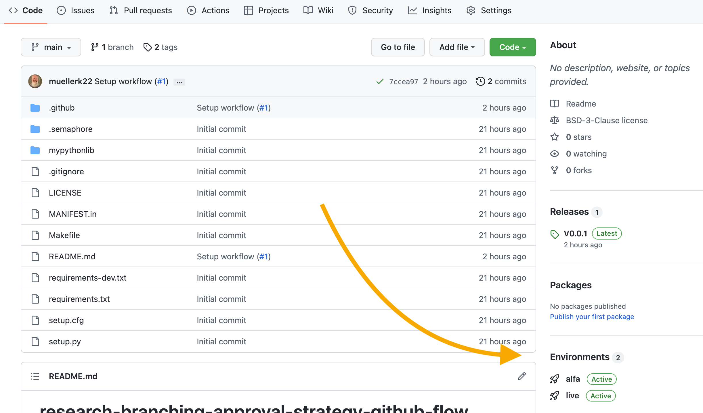
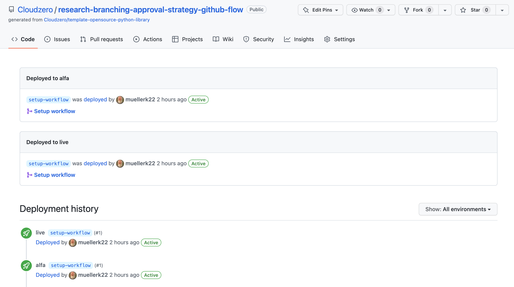

# research-branching-approval-strategy-github-flow

This repository simulates a new Continuous Deployment strategy that is based on [GitHub Flow](https://docs.github.com/en/get-started/quickstart/github-flow). This is single main branch strategy with feature branch merged to main after a PR then deleting feature branch.

[Release](https://docs.github.com/en/repositories/releasing-projects-on-github/about-releases) can be create to document what changes in a ChangeLog

Deployments to live can execute off of any GitHub event as described in [Deploying with GitHub Actions](https://docs.github.com/en/actions/deployment/about-deployments/deploying-with-github-actions).  n approval can be added using [GitHub Environments](<https://docs.github.com/en/actions/deployment/targeting-different-environments/using-environments-for-deployment>)

## Overview

GitHib Flow is described as

* Anything in the `main` branch is deployable
* To work on something new create a descriptively named branch off of of `main`
* Commit to that branch locally and regularly push your work to GitHub were it will be deployed to `alfa`
* When work is complete and ready for `live`, start a pull request
* After someone else has reviewed and signed off on the feature, it will merge to `main` and kick off the automated CD pipeline.
* The CD pipeline will build and test the code and then pause for a Deployment approval.
* Once approved, the CD pipeline will continue and create a release, deploy to `live`, and tag the `main` branch.

## Knowing what is in each environment?

What is in `live` and `alfa` is depicted in the "environments" section in the GitHub UI.

## Rollbacks

There are option here.  

1) One is the release can be deleted. This kicks off a workflow to deploy the `latest` which is the previous code deployed via the tag being present.
2) A new branch and PR can be cut to fix any issues.
